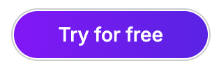
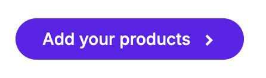

## Landing Page Buttons

On the landing page, we focus on visually appealing and action-driven buttons:

- **Primary Button**: The main call to action. Solid background, often used for "Get Started" or "Sign Up".



```html
<m-button label="Primary Button" variant="primary"></m-button>
```

- **Secondary Button**: A dark secondary button that is used for less prominent actions like "Learn More". On hover, the arrow moves too.



```html
<m-button label="Secondary Button" variant="secondary"></m-button>
```

## Dashboard

[to be continued]
